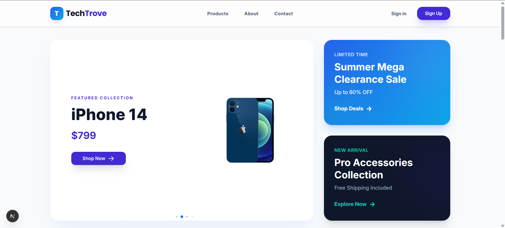

# TechTrove - Premium E-Commerce Platform



TechTrove is a sophisticated, high-performance product management and e-commerce platform built with the latest **Next.js 16 (App Router)** and **Tailwind CSS 4**. It features a stunning, premium UI with smooth animations, secure authentication, and a robust product management system.

---

## 🔗 Project Links

- **Live Deployment:** [https://techtrove-ahd.vercel.app/](https://techtrove-ahd.vercel.app/)
- **Client-Side Repository:** [https://github.com/alhasandhali/mini-ecommerce-client-side](https://github.com/alhasandhali/mini-ecommerce-client-side)
- **Server-Side Repository:** [https://github.com/alhasandhali/mini-ecommerce-server-side](https://github.com/alhasandhali/mini-ecommerce-server-side)

---

## ✨ Key Features

### 🛍️ Shopping Experience
- **Dynamic Product Catalog:** Browse a categorized list of high-quality tech products.
- **Detailed Product Views:** In-depth information, specifications, and imagery for every item.
- **Premium UI/UX:** Built with glassmorphism effects, curated color palettes, and responsive layouts.

### 🔐 Security & Authentication
- **NextAuth Integration:** Secure login via Google OAuth and traditional credentials.
- **Protected Routes:** Administrative features like adding or managing products are restricted to authorized users.

### 🛠️ Product Management
- **Full CRUD Support:** Add, View, Update, and Delete products seamlessly.
- **Inventory Control:** Manage stock levels and product details through a dedicated dashboard.

### 🎨 Design & Animation
- **Tailwind CSS 4:** Utilizing the latest styling engine for maximum performance.
- **Framer Motion:** Smooth micro-interactions and page transitions.
- **Responsive Design:** Optimized for mobile, tablet, and desktop environments.

---

## 🚀 Tech Stack

- **Frontend:** Next.js 16, React 19, Tailwind CSS 4, DaisyUI 5
- **State & Data:** TanStack Query (React Query), Axios
- **Authentication:** NextAuth.js
- **Animations:** Framer Motion, Swiper.js
- **Form Handling:** React Hook Form

---

## 📁 Project Structure

```text
e-commerce-client/
├── public/              # Static assets (images, icons, etc.)
├── src/
│   ├── app/             # Next.js App Router (Pages & Layouts)
│   │   ├── about/       # About Page
│   │   ├── add-product/ # Product Creation Page (Protected)
│   │   ├── all-products/# Full Catalog Page
│   │   ├── api/         # Next.js API Routes
│   │   ├── contact/     # Contact Information Page
│   │   ├── login/       # Authentication (Login)
│   │   ├── signup/      # Authentication (Sign Up)
│   │   ├── manage-products/ # Product Admin Dashboard
│   │   ├── product/     # Dynamic Product Detail Pages
│   │   ├── layout.jsx   # Root Layout
│   │   ├── page.jsx     # Homepage
│   │   └── globals.css  # Global Stylings & Tailwind Config
│   ├── components/      # Reusable UI Components
│   │   ├── Banner/      # Hero Sections
│   │   ├── FeaturedProducts/
│   │   ├── Navbar/      # Sticky Navigation with User Menu
│   │   ├── ProductCard/ # Responsive Product Items
│   │   ├── Footer/      # Site-wide Footer
│   │   └── ...          # Other UI Elements
│   └── proxy.js         # API Proxy configuration
├── package.json         # Dependencies & Scripts
└── tailwind.config.js   # Tailwind Configuration
```

---

## 🛠️ Installation & Setup

### 1. Clone the Repository
```bash
git clone https://github.com/alhasandhali/mini-ecommerce-client-side.git
cd mini-ecommerce-client-side
```

### 2. Install Dependencies
```bash
npm install
```

### 3. Environment Variables
Create a `.env` file in the root directory and add the following:

```env
GOOGLE_CLIENT_ID=your_google_client_id
GOOGLE_CLIENT_SECRET=your_google_client_secret
NEXTAUTH_URL=http://localhost:3000
NEXTAUTH_SECRET=your_nextauth_secret_any_random_string
```

### 4. Run the Development Server
```bash
npm run dev
```

The application will be available at [http://localhost:3000](http://localhost:3000).

---

## 👨‍💻 Developer Information

Developed with ❤️ by **Alhasan Dhali**. 

---

## 📝 License
This project is licensed under the MIT License.
